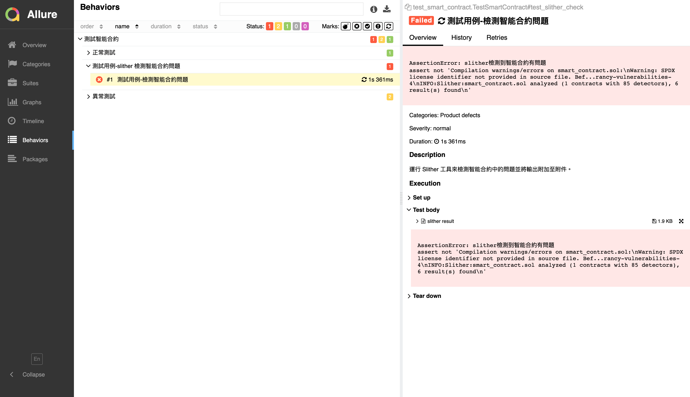

# test_smart_contract_web3

這是一個用於測試以太坊智能結合約中轉帳功能的Python腳本，
使用了多個Python庫，包括web3、eth_account、solcx、loguru和orjson。
安全性檢測工具為：Slither。

Allure report page(測試報告結果頁面)：[https://coseto6125.github.io/test_smart_contract_web3/
](https://coseto6125.github.io/test_smart_contract_web3/)

較完整頁面：[https://coseto6125.github.io/test_smart_contract_web3/#behaviors/aca6e1eb8281a67176e0d2a648d01a32/2c1116b2873ebc43/](https://coseto6125.github.io/test_smart_contract_web3/#behaviors/aca6e1eb8281a67176e0d2a648d01a32/2c1116b2873ebc43/)

**請注意，此代碼中使用的地址和密匙為 Ganache 虛擬環境產生。
v1 . image**

v1 . image

## 概要

該腳本連接到本地的以太坊節點，譯了一個名為 SimpleTransfer 的 Solidity 智能合約。該合約實現了轉賬功能，並使用數字簽名來驗證轉賬請求的合法性。

測試腳本通過部署智能合約、構造轉賬請求、驗證數字簽名和檢查轉賬結果等步驟，對智能合約進行了全面的測試。

在測試過程中，代碼使用了 allure 庫生成測試報告。

該報告包含了測試用例的詳細信息、測試結果和相關日期誌等。所有測試測試用例都被分組為一個名為“測試智能合約”的測試特性。每個測試用例都有一個標題和多個步驟，用於詳細描述測試過程和測試結果。

最後，測試結果被保存為HTML格式的報告，可以通過瀏覽器查看。該腳本可以用於測試以太坊智能合約開發中的轉賬功能，也可以作為拓展其他智能結合測試的基本代碼。

# test_smart_contract_web3

This is a Python script for testing transfer functions in Ethereum smart contracts. It uses multiple Python libraries, including web3, eth_account, solcx, loguru, and orjson.
The security analysis tool is called Slither.

Please note that the addresses and keys used in this code are specific to the Ganache virtual environment and should not be used in a production environment.

Allure report page：[https://coseto6125.github.io/test_smart_contract_web3/](https://coseto6125.github.io/test_smart_contract_web3/)

more detail page: [https://coseto6125.github.io/test_smart_contract_web3/#behaviors/aca6e1eb8281a67176e0d2a648d01a32/2c1116b2873ebc43/](https://coseto6125.github.io/test_smart_contract_web3/#behaviors/aca6e1eb8281a67176e0d2a648d01a32/2c1116b2873ebc43/)

## Overview

The script connects to a local Ethereum node and compiles a Solidity smart contract named SimpleTransfer. This contract implements the transfer function and uses digital signatures to verify the legality of transfer requests. The testing script performs comprehensive testing on the smart contract by deploying the contract, constructing transfer requests, verifying digital signatures, and checking transfer results.

During the testing process, the code uses the allure library to generate a test report. The report includes detailed information about the test cases, test results, and relevant logs. All test cases are grouped into a test feature named "Test Smart Contract." Each test case has a title and multiple steps to describe the testing process and results in detail.

Finally, the test results are saved as an HTML report that can be viewed in a browser. This script can be used to test transfer functions in Ethereum smart contract development and also serve as basic code for testing other smart contracts.
